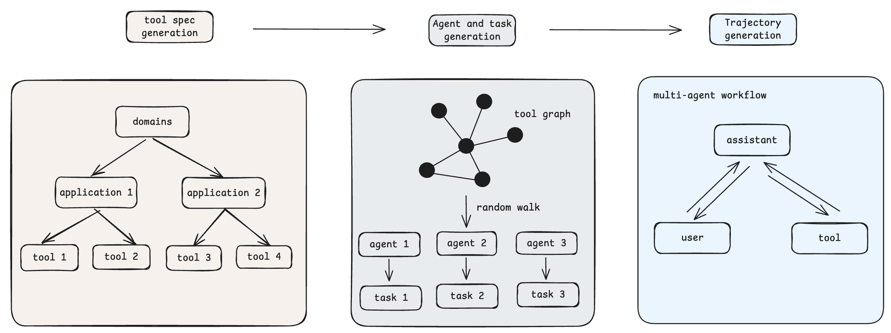
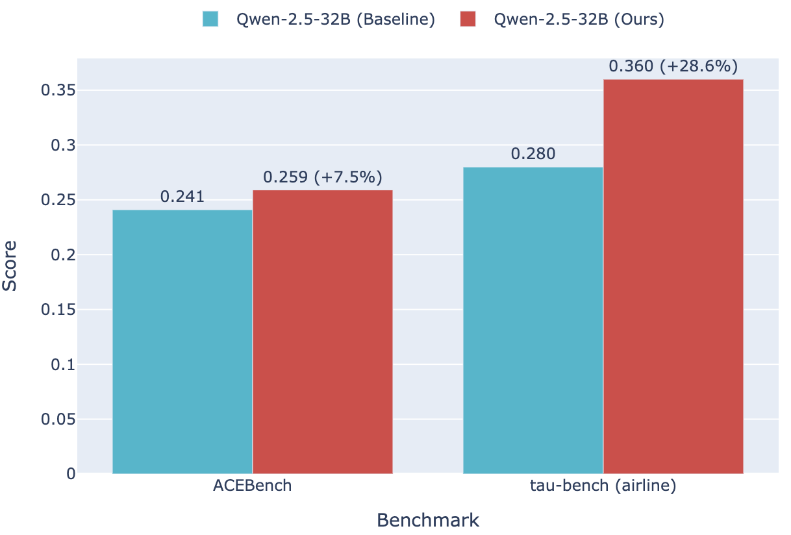

# AgenticGen: Multi-Agent Data Synthesis System

A multi-agent data synthesis system based on large language models for automatically generating high-quality agent training data. By simulating realistic multi-turn dialogue scenarios, it enables automated generation of large-scale diverse agent interaction trajectories.



## Project Overview

AgenticGen is a complete data synthesis pipeline designed to address the scarcity of agent training data. The system automatically generates high-quality training data through six core steps:

1. **Scenario Generation** - Generate diverse application scenarios based on predefined domains
2. **Tool Design** - Design specialized tool sets for each scenario
3. **Agent Synthesis** - Combine system prompts and tool sets to generate diverse agents
4. **Task Generation** - Generate tasks of different difficulty levels for each agent
5. **Trajectory Generation** - Simulate multi-turn interactions between users and agents
6. **Quality Assessment** - Filter high-quality trajectories based on scoring criteria

## Core Features

- **Diverse Generation** - Supports combinations of multiple scenarios, tools, agents, and user personas
- **High Concurrency Processing** - Supports multi-threaded concurrent generation to improve data generation efficiency
- **Quality Control** - Built-in quality assessment mechanism to ensure high-quality generated data
- **Scalability** - Supports custom scenarios, tools, and evaluation criteria

## Application Scenarios

1. **General Agent Data Generation** - Generate diverse scenarios and tools based on predefined domains, synthesize multi-turn interaction trajectories
2. **Domain Data Generation** - Generate tool sets and interaction trajectories that meet domain requirements for specific vertical scenarios
3. **Existing Tool Set Extension** - Generate multi-turn dialogue trajectories containing existing tools based on available tool sets

## 🛠️ Installation and Configuration

### Installation Steps

1. **Clone the Project**
```bash
git clone <repository-url>
cd agent_data_gen
```

2. **Install Dependencies**
```bash
pip install -r requirements.txt
```

3. **Configure Environment Variables**

Copy `.env.template` to create `.env` file:

```bash
# LLM Configuration
OPENAI_API_KEY=your_openai_api_key
OPENAI_BASE_URL=https://api.openai.com/v1
OPENAI_MODEL=gpt-4
OPENAI_TEMPERATURE=0.7
DEFAULT_LLM_PROVIDER=openai
```

## Quick Start

The system adopts a modular design, supporting complete pipeline execution or individual module operation. It is recommended to execute in the following order:

### 1. Scenario Generation

Generate detailed application scenario descriptions based on predefined domains. First configure target domains in `config/settings.py`:

```python
self.GENERATION_CONFIG = {
    "scenarios": {
        # you can add more domains here
        "domains": [
            "food_delivery",
            "robot_control",
            "social_media",
            "ecommerce",
            "travel",
            ],
    }
}
```

Execute scenario generation:
```bash
python scripts/scenarios/generate_scenarios.py
```

### 2. Tool Generation and Filtering

Design specialized tool sets based on generated scenarios, with each tool containing complete parameter definitions and functional descriptions:

```bash
# Generate tool collections
python scripts/tool/generate_tools.py

# Compute tool embedding vectors
python scripts/tool/compute_tool_embeddings.py

# Tool quality evaluation
python scripts/tool/evaluate_tools.py

# Deduplicate and filter high-quality tools
python scripts/tool/filter_tool.py
```

### 3. Agent Generation

Generate agents with different specializations by combining different tool sets (3-6 tools) using random walk method:

```bash
python scripts/agent/generate_agents.py
```

### 4. Task Generation

Generate tasks at three difficulty levels (simple, medium, complex) for each agent:

```bash
python scripts/task/generate_tasks.py
```

### 5. Trajectory Generation

Simulate multi-turn interactions between users and agents to generate dialogue trajectories:

```bash
python scripts/trajectory/generate_trajectory.py
```

### 6. Trajectory Evaluation and Filtering

Filter high-quality trajectories based on multi-dimensional scoring criteria:

```bash
# Trajectory quality scoring
python scripts/trajectory/score_trajectory.py

# Filter high-quality trajectories
python scripts/trajectory/filter_high_quality_trajectories.py

# Convert to training data format
python scripts/trajectory/convert_to_training_data.py
```

## Effectiveness Validation

To validate the effectiveness of AgenticGen, we trained a Qwen2.5-32B model using a synthesized dataset of 2000 multi-turn tool calling samples, with the following results:



**Training Results**:
- ACEBench evaluation improved by 7.5%
- Tau-Bench evaluation improved by 28.6%
- Significantly enhanced model agent capabilities

## Extension Development

### Adding New Scenario Domains

1. Add new domains to the `domains` list in `config/settings.py`
2. Add corresponding prompt templates in `config/prompts/scenario_prompts.py`

### Custom Evaluation Criteria

1. Modify evaluation logic in `modules/quality_judge/trajectory_evaluator.py`
2. Update evaluation prompts in `config/prompts/evaluation_prompts.py`

## License

Apache 2.0

---

If you have any questions or suggestions, please feel free to submit an Issue or contact the project maintainers.
