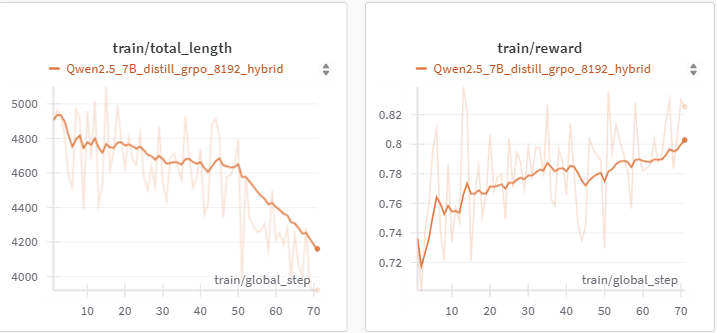
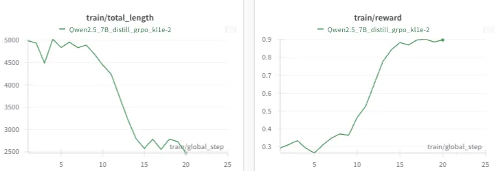

# R1-like 的 RL Tutorial

这个 Tutorial 中，我们使用 OpenRLHF 框架在数学领域复现 DeepSeek-R1 的强化学习训练过程（先利用 Long-CoT 数据对 pretrained base model 进行 sft，再进行 RL），内容包括：

- [OpenRLHF 介绍](#openrlhf-介绍)
- [准备数据](#准备数据)
- [自定义 Reward function](#自定义-reward-function)
- [启动训练](#启动训练)
- [实验结果](#实验结果)
- [消融实验](#消融实验)


## OpenRLHF 介绍

本节内容会对 OpenRLHF 的安装和关键参数进行简单介绍，如果读者对 OpenRLHF 已经有所了解，可以直接跳转到"[准备数据](#准备数据)"章节。

### 准备环境

使用以下命令，构建OpenRLHF启动的Docker 容器:

```bash
docker run --runtime=nvidia -it --rm --shm-size="10g" --cap-add=SYS_ADMIN -v $PWD:/openrlhf nvcr.io/nvidia/pytorch:24.07-py3 bash
sudo pip uninstall xgboost transformer_engine flash_attn pynvml -y

# 需要使用vllm进行推理加速
pip install openrlhf[vllm]

# 可选，对于数学任务，需安装math-verify，校验数学答案的准确性
pip install math-verify==0.6.0
```


### 关键参数说明

| 类别 | 参数 | 说明 |
|------|------|------|
| Basic | pretrain | 原始模型路径，可以填 huggingface 路径 或者 本地模型文件路径 |
| Basic | prompt_data | 训练数据路径，可以填 huggingface 路径 或者 本地数据文件路径 |
| Basic | input_key | 数据文件中 prompt 部分所对应的 key |
| Basic | label_key | 数据文件中 label 部分所对应的 key |
| 训练参数 | train_batch_size | rollout 结束后，更新 actor 参数时的 batch_size |
| 训练参数 | rollout_batch_size | 在 rollout 阶段，每个 RL step 消耗的 prompt 的数量 |
| 训练参数 | n_samples_per_prompt | 在 rollout 阶段，为每个 prompt 生成的responses的数量 |
| 训练参数 | advantage_estimator | 使用的 RL 算法，目前支持 PPO、GRPO、Reinforce++等 |
| 训练参数 | num_episodes | 在整个训练集上训练的 epoch 数量 |
| 训练参数 | init_kl_coef | KL 系数 |
| 训练参数 | temperature | 在 rollout 阶段，为 prompt 生成 response 时需要的温度系数 |
| 部署参数 | actor_num_nodes | actor 的节点数量 |
| 部署参数 | actor_num_gpus_per_node | actor 每个节点使用的 GPU 数量 |
| 部署参数 | ref_num_nodes | reference model 的节点数量 |
| 部署参数 | ref_num_gpus_per_node | reference model 每个节点使用的 GPU 数量 |
| 部署参数 | vllm_num_engines | vLLM engine 的数量 |
| 部署参数 | vllm_tensor_parallel_size | 每个 vLLM engine 的TP size |
| 部署参数 | vllm_gpu_memory_utilization | The proportion of the remaining GPU memory allocated for kv cache after other models have initialized when using vllm |
| 部署参数 | colocate_all_models | 是否将所有模型（包括 vLLM 引擎）托管在一起，如果是这样，它们将共享相同的 GPU |
| 部署参数 | remote_rm_url | reward model function 或者 remote RM API |

> 注意：其余训练常用参数，如 lr、warmup 这里不详细说明，具体设置参考后面的章节

## 准备数据

### OpenRLHF支持的数据格式

OpenRLHF提供了多种数据处理方法，可支持灵活的数据格式。另外，也可自定义dataset类，详细可见：[OpenRLHF Dataset 类](https://github.com/OpenRLHF/OpenRLHF/tree/main/openrlhf/datasets)

简单的例子如下：

```python
def preprocess_data(data, input_template=None, input_key="input", apply_chat_template=None) -> str:
    if apply_chat_template:
        chat = data[input_key]
        if isinstance(chat, str):
            chat = [{"role": "user", "content": chat}]
        prompt = apply_chat_template(chat, tokenize=False, add_generation_prompt=True)
    else:
        prompt = data[input_key]
        if input_template:
            prompt = input_template.format(prompt)
    return prompt
```

OpenRLHF 提供了三种不同的数据处理方式：
1. 方式一：设置 `--apply_chat_template` 参数，从而利用 Huggingface Tokenizer 中的 chat_template
2. 方式二：使用 `--input_template` 参数，从而使用自定义 template
3. 方式三：预先离线处理数据集，按照自定义格式合成prompt

### 处理训练数据

本节以方式三为例，预先离线处理数据集，并按照自定义格式合成 prompt。

处理数据集的流程如下：

1. 首先需要下载 ORZ 数据集到本路径[ORZ dataset](https://github.com/Open-Reasoner-Zero/Open-Reasoner-Zero/blob/main/data/orz_math_57k_collected.json)
2. 执行脚本 `python prepare_datast.py`


其中，核心的处理逻辑如下：

```python


user_prompt = """Please reason step by step, and put your final answer within \\boxed{}."""

tokenizer = AutoTokenizer.from_pretrained("deepseek-ai/DeepSeek-R1-Distill-Qwen-1.5B")

# 使用 Qwen 的对话模板格式化问答对
messages = [
{"role": "user", "content": question + " " + user_prompt},
]

# 应用 Qwen 的对话模板
formatted_prompt = tokenizer.apply_chat_template(
    messages,
    tokenize=False,
    add_generation_prompt=True
)
```

*DeepSeek-R1-Distill-Qwen 系列模型采用的Prompt Template 和 Qwen本身完全不一样，请确保使用DeepSeek-R1-Distill的 Template*


自定义处理后的格式如下：

```json
{
    "input": "<｜begin▁of▁sentence｜><｜User｜>At the end of a chess tournament, the top 6 players have a playoff. The seedings are such that #6 plays #5 first. The loser gets the 6th prize. The winner then plays #4, the loser of this game gets the 5th prize. The winner plays #3, the loser gets the 4th prize. This is followed by the winner playing #2, where the loser gets the 3rd prize. Finally, the winner confronts #1 and the loser receives the 2nd prize while the winner receives the 1st prize. Calculate the number of different ways the 6 prizes can be distributed among the players. Please reason step by step, and put your final answer within \\boxed{}.<｜Assistant｜><think>\n",
    "ground_truth_answer": "32"
  },
```

字段说明：
- `input`: 模型输入的内容，包括输入模版、prompt 和用户问题
- `ground_truth_answer`: 问题的答案


准备好数据集后，在启动脚本中按照如下设置：
```bash
--prompt_data <Your Data Name> \
--input_key input \ # 对应输入字段
--label_key ground_truth_answer \ # 对应答案字段
```
## 自定义 Reward function

OpenRLHF 中支持通过传入 Python 文件的方式来定义 Reward function, 详细使用方法可查看`--remote_rm_url`参数。本节中，我们使用 [r1_reward_func.py](./r1_reward_func.py) 来作为数学实验上的 Reward function。

其主要逻辑为：
1. 最终的 reward 包含 accuracy reward 和 length reward 两部分
2. accuracy reward: 判断生成的答案与 ground truth 的答案是否一致，一致的话 reward 为 1，否则 reward 为 0
3. length reward: 对于生成长且正确的样本添加一个正向 reward，对于生成短且正确的样本添加一个负向 reward，从而鼓励模型往更长的思维链方向探索
4. 考虑到经过蒸馏训练后，模型本身已经具有一定的 thinking 能力，并且已经能够正确输出格式。 因此，在本节 Reward 设计中，没有添加 格式 reward


## 启动训练
启动训练的脚本为 [train_distill_7b_grpo_ray_hybrid_engine.sh](./train_distill_7b_grpo_ray_hybrid_engine.sh) 中，读者可以参考该脚本进行训练。

```bash
ray start --head --node-ip-address 0.0.0.0 --num-gpus 8

sh train_distill_7b_grpo_ray_hybrid_engine.sh

```

## 实验结果

### 训练曲线


*训练 DeepSeek-Distill-7B 的训练曲线*

### 实验评估

- DeepSeek-R1-Distill-Qwen-1.5/7B 模型经过蒸馏训练，本身已经具有reasoning能力，初始阶段表现已经不错。
- 通过RL继续训练，模型的 reward 可以继续升高。

| 数据集 | AIME 2024 | GPQADiamond |
|--------|------|-------------|
| Qwen-distill-7B | 0.5167 | 0.5463 |
| step-30 | 0.5792 | 0.5463 |


- 观察到，通过 reward shaping 的方式，能够激励模型生成更长的思维链，在20个 step 之后模型的思维链长度开始稳定提升。
- 在AIME 2024上，模型的提升非常明显，即使在 Qwen-distill-7B 已经取得0.5167 的情况下， 能够进一步提升至 0.5792 (12%)


## 消融实验

在本节，我们对于RL训练比较关键的参数进行了一些消融实验。

### Reward 设计

分析 reward shaping 对于最终实验结果的影响，下面这个实验只使用 accuracy_reward, 不使用 length reward



- 由于 DeepSeek-R1-Distill-Qwen 模型经过蒸馏后，本身已经能输出很长的思维链，当response length = 10k 时，部分长且正确得样本会被截断从而得0分，导致模型会倾向于缩短思维链长度。

### KL Loss

分析 kl loss 的取值对于最终实验效果的影响，下面这个实验kl=1e-2 （上面的实验中kl=0.0）



- 这个实验采取 kl=1e-2，观察到 response length 快速减少，reasoning 能力退化。
- 结论：RL 训练时建议设置较小的 kl 值。


### Rollout Batch Size

分析不同 rollout batch size 设置对于最终实验结果的影响。


- 这个实验采取rollout batch size=64 ( 在上面实验中设置为256 )，整个训练过程更加抖动，波动更大。
- response length 和 reward收敛都不好。
- 结论：大的 rollout batch size 对于整个训练的稳定性比较重要。


